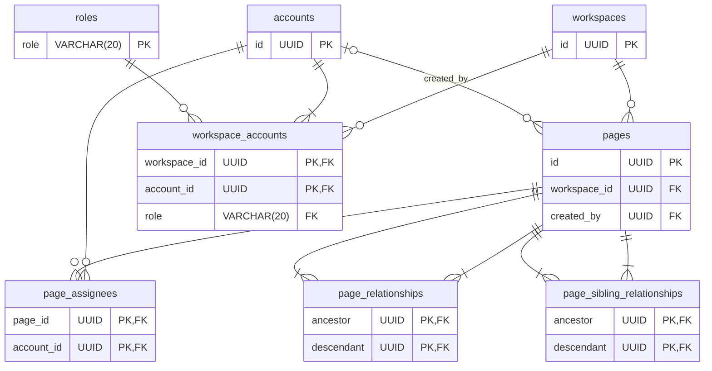

# ER図

```mermaid
erDiagram
  workspaces {
    id UUID PK
  }
  accounts {
    id UUID PK
  }
  roles {
    role VARCHAR(20) PK
  }
  pages {
    id UUID PK
    workspace_id UUID FK
    created_by UUID FK
  }
  page_relationships {
    ancestor UUID PK,FK
    descendant UUID PK,FK
  }
  page_sibling_relationships {
    ancestor UUID PK,FK
    descendant UUID PK,FK
  }
  workspace_accounts {
    workspace_id UUID PK,FK
    account_id UUID PK,FK
    role VARCHAR(20) FK
  }
  page_assignees {
    page_id UUID PK,FK
    account_id UUID PK,FK
  }

  workspaces ||--o{ workspace_accounts : ""
  accounts ||--|{ workspace_accounts : ""
  roles ||--o{ workspace_accounts : ""

  workspaces ||--o{ pages : ""

  accounts |o--o{ pages : "created_by"

  accounts ||--o{ page_assignees : ""
  pages ||--o{ page_assignees : ""

  pages ||--|{ page_relationships : ""
  page_relationships }|--|| pages : ""

  pages ||--|{ page_sibling_relationships : ""
  page_sibling_relationships }|--|| pages : ""
```
