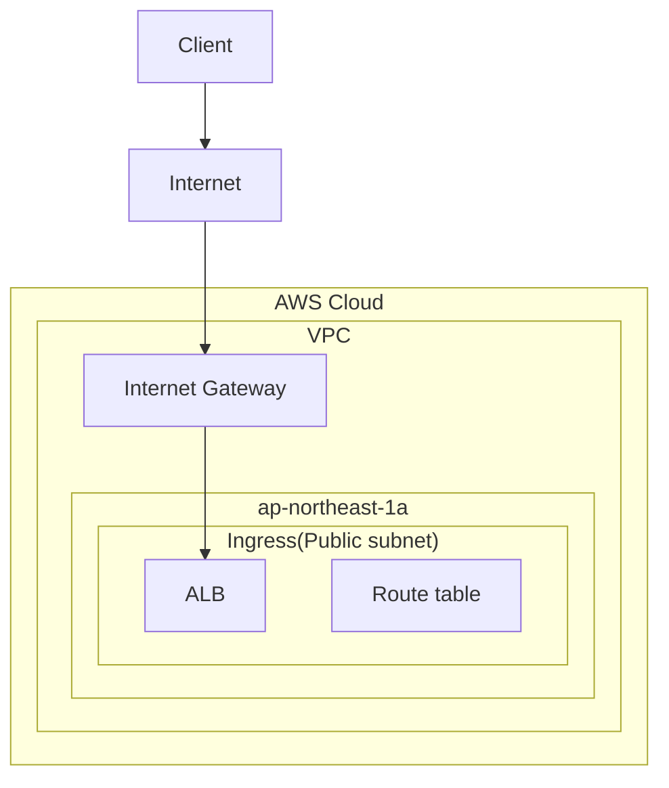

# Architecture Diagram

```mermaid
flowchart TB

Client --> Internet
Internet --> internet-gateway
internet-gateway --> ALB

subgraph aws-cloud[AWS Cloud]
  subgraph vpc[VPC]
    internet-gateway[Internet Gateway]
    subgraph ap-northeast-1a
      subgraph ingress["Ingress(Public subnet)"]
        ALB
        route-table[Route table]
      end
    end
  end
end
```
