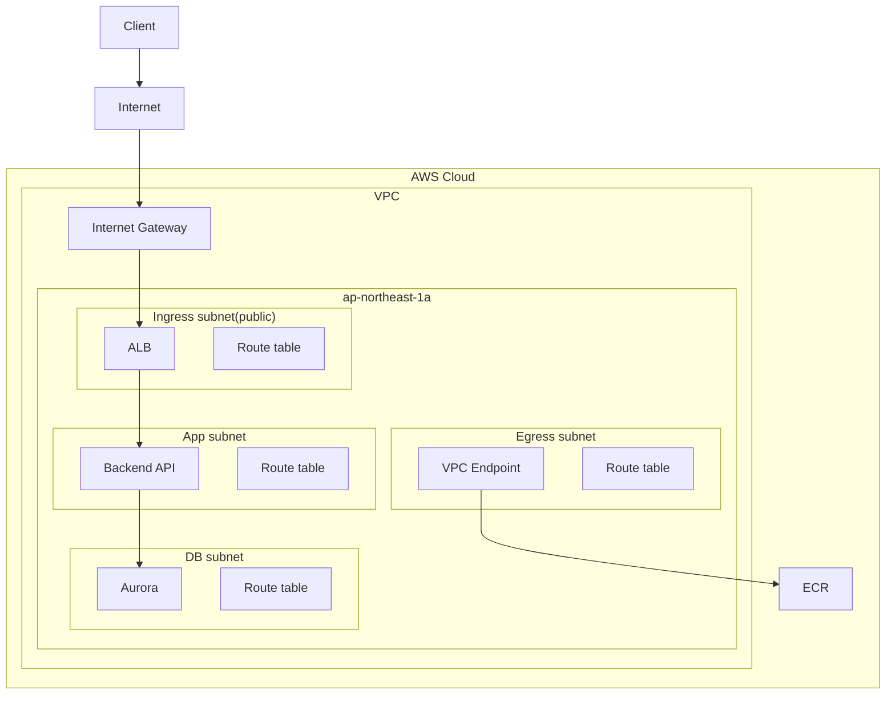

# Architecture Diagram

```mermaid
flowchart TB

Client -->
Internet -->
internet-gateway -->
ALB -->
backend-api -->
Aurora
egress-vpc-endpoint --> ECR

subgraph aws-cloud[AWS Cloud]
  subgraph vpc[VPC]
    internet-gateway[Internet Gateway]
    subgraph ap-northeast-1a
      subgraph ingress-subnet["Ingress subnet(public)"]
        ALB
        ingress-route-table[Route table]
      end
      subgraph app-subnet[App subnet]
        backend-api[Backend API]
        app-route-table[Route table]
      end
      subgraph db-subnet[DB subnet]
        Aurora
        db-route-table[Route table]
      end
      subgraph egress-subnet[Egress subnet]
        egress-vpc-endpoint[VPC Endpoint]
        egress-route-table[Route table]
      end
    end
  end
  ECR
end
```
