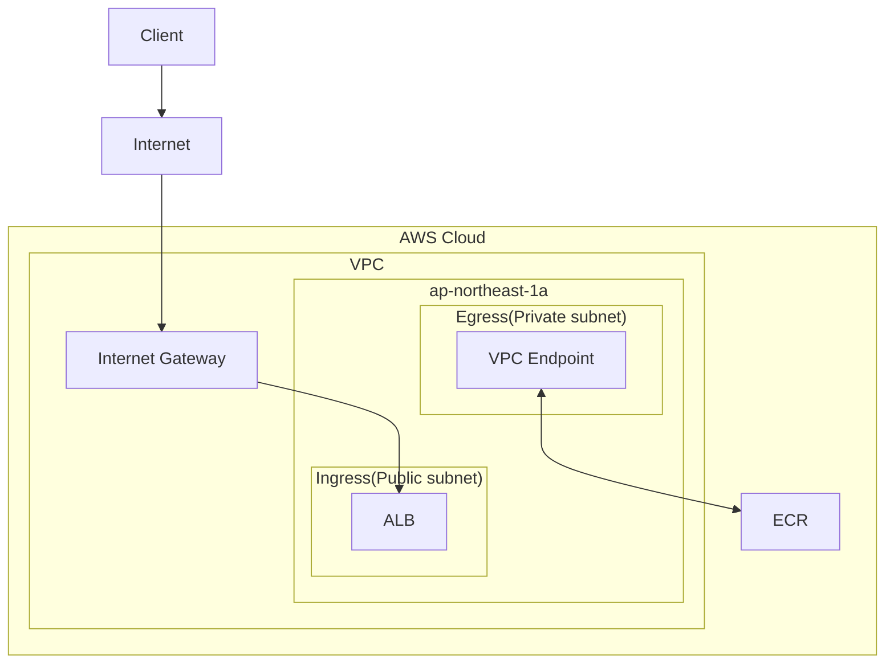

# Architecture Diagram

```mermaid
flowchart TB

Client --> Internet
Internet --> internet-gateway
internet-gateway --> ALB
egress-vpc-endpoint <--> ECR

subgraph aws-cloud[AWS Cloud]
  subgraph vpc[VPC]
    internet-gateway[Internet Gateway]
    subgraph ap-northeast-1a
      subgraph ingress["Ingress(Public subnet)"]
        ALB
      end
      subgraph egress["Egress(Private subnet)"]
        egress-vpc-endpoint[VPC Endpoint]
      end
    end
  end
  ECR
end
```
